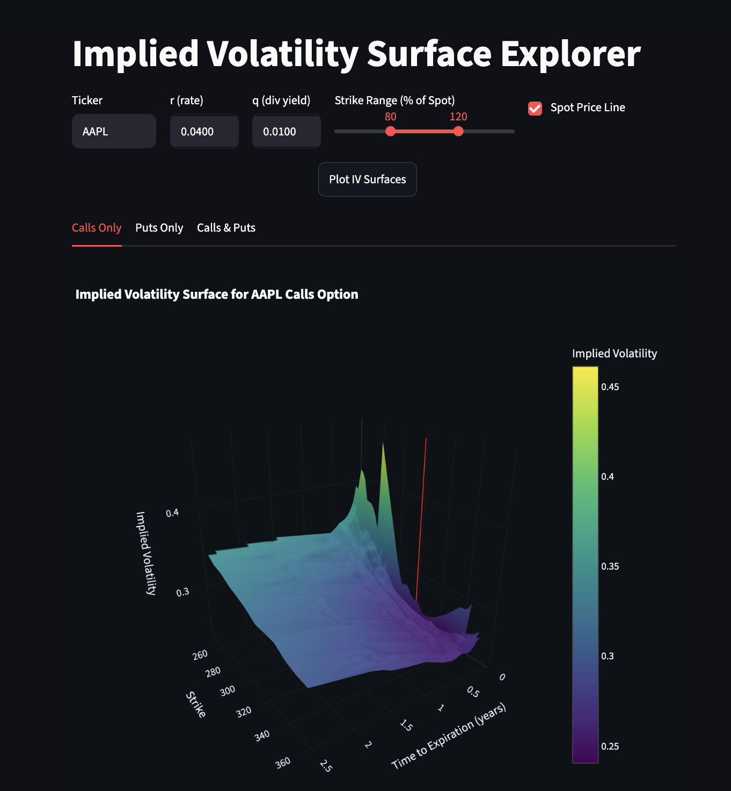

# Implied Volatility Surface Explorer

An interactive web app that pulls **live options data** from Yahoo Finance, computes **Black–Scholes implied volatilities** from market prices, and renders **interactive 3D volatility surfaces** for calls, puts, and both combined — all in a clean Streamlit dashboard.


**🔗 Live demo:** [impliedvolatility-app.streamlit.app](https://impliedvolatility-app.streamlit.app/)



**Key Features:**

- **Real-time Data:** Instantly imports option chains for any stock symbol.
- **Flexible Analysis:** Customize risk-free rate, dividend yield and more.
- **Interactive 3D Plots:** Explore and compare call, put, and combined IV surfaces.
- **Fast & Efficient:** Smart caching dramatically speeds up repeated analyses.
- **Clean Dashboard UI:** All controls organized in a compact, responsive panel.

**Explore the live demo above, or check out the code and run locally to start visualizing real-world options volatility in seconds!**

## Overview

The **implied volatility surface** is one of the most important objects in options trading: it shows how the market's expectation of future volatility varies across strike prices and expiration dates. Its shape (the volatility *smile* and *term structure*) reveals how option prices deviate from the constant-volatility assumption of the Black–Scholes model.

This app reconstructs that surface in real time for any optionable ticker: it fetches the live option chain, backs out the implied volatility from each contract's mid price by inverting Black–Scholes, and interpolates the result into a smooth, rotatable 3D surface.

## Key features

- **Live market data** — fetches real option chains for any ticker via `yfinance`
- **Black–Scholes IV solver** — inverts the BS formula numerically (Brent's method) to recover implied vol from market mid prices
- **Interactive 3D surfaces** — explore call, put, and combined call/put surfaces in separate tabs (Plotly)
- **Liquidity filtering** — screens out illiquid contracts (zero bid/ask, open interest ≤ 200, near-dated expiries) for a cleaner surface
- **Configurable** — adjust the risk-free rate `r`, dividend yield `q`, and strike range as a % of spot
- **Fast** — 5-minute caching on data fetches so repeated queries are near-instant
- **Spot reference line** — optional marker at the current underlying price

## How it works

```
Yahoo Finance option chain
        │
        ▼
Filter for liquidity (bid/ask > 0, OI > 200, T > 10 days)
        │
        ▼
Compute mid price → invert Black–Scholes for implied vol (brentq)
        │
        ▼
Interpolate (strike × time-to-expiry) onto a 50×50 grid (scipy griddata)
        │
        ▼
Render interactive 3D surface (Plotly) — calls / puts / both
```

## Tech stack

`Python` · `Streamlit` · `NumPy` · `SciPy` · `pandas` · `Plotly` · `yfinance`


## References

- [Implied volatility — Wikipedia](https://en.wikipedia.org/wiki/Implied_volatility)
- [Volatility smile — Wikipedia](https://en.wikipedia.org/wiki/Volatility_smile)
- [Black–Scholes model — Wikipedia](https://en.wikipedia.org/wiki/Black%E2%80%93Scholes_model)
- [Volatility (finance) — Wikipedia](https://en.wikipedia.org/wiki/Volatility_(finance))